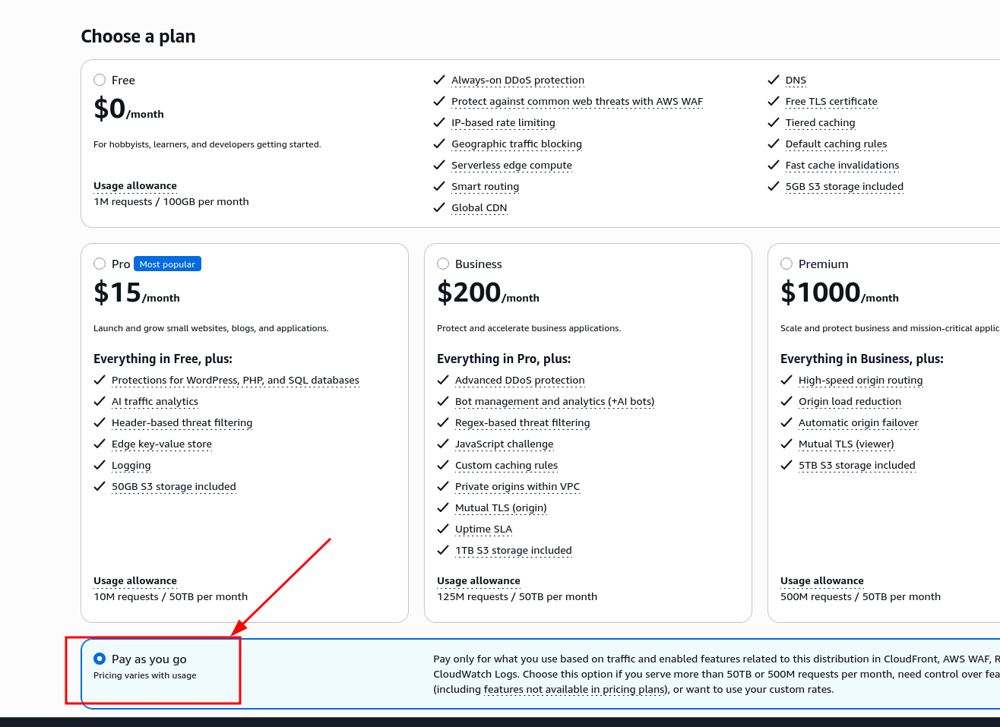
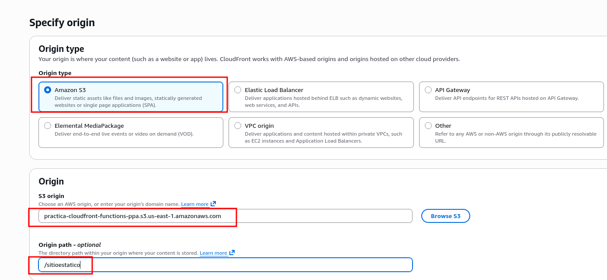
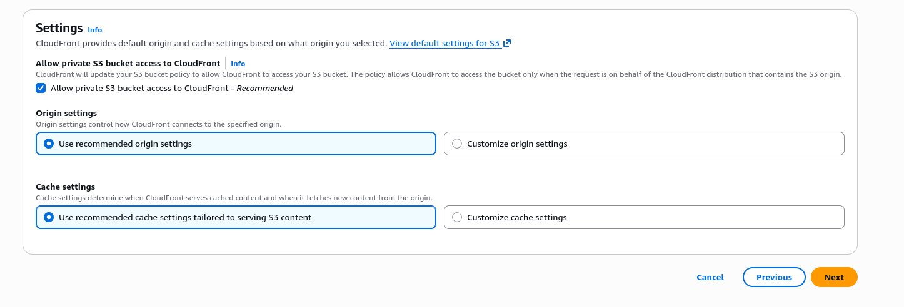
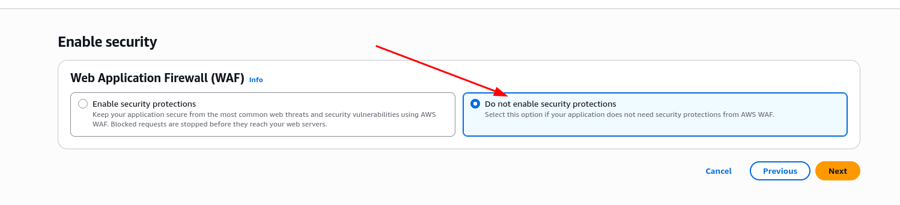
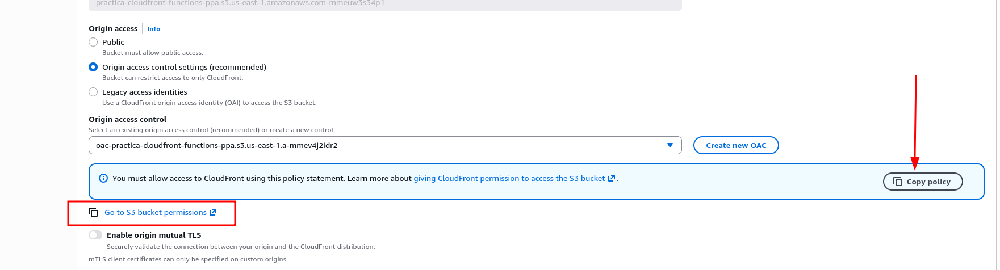
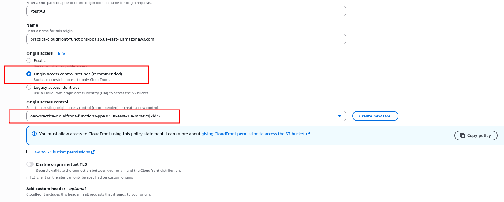

* Computación en el borde
#+begin_quote
[!IMPORTANT]
Utilizaremos la *Landing Zone* en la región ~us-east-1~ para realizar esta práctica.
#+end_quote

Los objetivos de esta práctica son los siguientes:
- Comprender los fundamentos de la computación en el borde
- Utilizar las *CloudFront Functions* para realizar procesamientos sencillos al acceder a un sitio web

** Referencias
- [[https://docs.aws.amazon.com/AmazonCloudFront/latest/DeveloperGuide/cloudfront-functions.html][Customize at the edge with CloudFront Functions]]
- [[https://docs.aws.amazon.com/AmazonCloudFront/latest/DeveloperGuide/functions-event-structure.html][CloudFront Functions event structure]]
- [[https://docs.aws.amazon.com/AmazonCloudFront/latest/DeveloperGuide/functions-tutorial.html][Tutorial: Create a simple function with CloudFront Functions]]

* Desarrollo de la práctica
** Creación del bucket
Crea un bucket con un nombre que incluya tu *nombre y apellidos*. Almacena en su interior el *contenido* de la carpeta ~assets~ que se proporciona en el repositorio.
#+begin_quote
[!IMPORTANT]
En la raíz del bucket deben aparecer *tres carpetas*:
- ~sitioestatico~
- ~redirigir~
- ~testAB~
#+end_quote

** Creación de la distribución CloudFront
Crea una distribución CloudFront de tipo *Pay as you go*.

#+begin_quote
[!IMPORTANT]
Si seleccionas algún otro tipo, como ~Free~, no podrás crear las funciones CloudFront de la práctica.
#+end_quote

Elige como origen el bucket S3 creado anteriormente. Ajusta el ~path~ para que acceda al contenido de la carpeta ~sitioestatico~ del bucket:

Deja los ajustes por defecto para configurar los permisos y opciones de caché:

Desactiva el WAF:

Acepta y crea la distribución. A continuación, *edita el origen* creado y sigue las instrucciones para *añadir los permisos adecuados al bucket S3* para que la distribución tenga acceso al bucket:

Acto seguido, *añade dos orígenes más* a la distribución. Ambos orígenes deben ir al *mismo bucket*, pero a *paths* diferentes. Deberás cambiar también el parámetro ~Name~ en uno de ellos para que tengan distinto nombre y no te dé un error al crear el segundo:
- ~/redirigir~
- ~/testAB~

Utiliza los mismos *Origin Access Control Settings* que se han creado anteriormente con el primer origen:

Una vez creados los 3 orígenes, pasaremos a añadir *dos distribuciones de caché* adicionales. Lo que pretendemos es lo siguiente:
- Las peticiones a las rutas ~/redirigir/*~ se reenviarán a la carpeta ~redirigir~ del bucket
- Las peticiones a las rutas ~/testAB/*~ se reenviarán a la carpeta ~testAB~ del bucket
- Las peticiones por defecto se reenviarán a la carpeta ~sitioestatico~ del bucket

Así:
- Una petición a ~https://MIDISTRIBUCION.cloudfront.net/index.html~ se enviará a ~sitioestatico/index.html~
- Una petición a ~https://MIDISTRIBUCION.cloudfront.net/carpeta1/index.html~ se enviará a ~sitioestatico/carpeta1/index.html~
- Una petición a ~https://MIDISTRIBUCION.cloudfront.net/redirigir/prueba.txt~ se enviará a ~redirigir/prueba.txt~
- Una petición a ~https://MIDISTRIBUCION.cloudfront.net/testAB/index.html~ se enviará a ~testAB/index.html~

Por tanto, *crea dos distribuciones de caché* adicionales para las rutas ~/redirigir/*~ y ~/testAB/*~, que deberán enlazar con los orígenes correspondientes. Utiliza la *política de caché* ~CachingDisabled~ para desactivar la caché. Adjunta captura de pantalla de las opciones seleccionadas.

Para terminar, *comprueba el funcionamiento accediendo a estas URLs* (sustituyendo ~MIDISTRIBUCION~ por el nombre de tu distribución):
- https://MIDISTRIBUCION.cloudfront.net (debe dar un error, porque no hemos establecido un objeto root por defecto)
- https://MIDISTRIBUCION.cloudfront.net/index.html
- https://MIDISTRIBUCION.cloudfront.net/carpeta1/index.html
- https://MIDISTRIBUCION.cloudfront.net/carpeta2/index.html
- https://MIDISTRIBUCION.cloudfront.net/redirigir/prueba.txt
- https://MIDISTRIBUCION.cloudfront.net/testAB/index.html

** Creación de las funciones CloudFront
- En este apartado deberás crear *3 CloudFront Functions*, *una para cada distribución de caché*
- Utiliza como Runtime ~cloudfront-js-2.0~ en los tres casos
- Las tres funciones están pensadas para asociarse a las ~Viewer request~ de las distribuciones de caché (se ejecutarán *antes* de que la petición llegue a la caché)
- Recuerda que, además de crear la función, deberás *publicarla* para poder utilizarla en tu distribución.

*** Función ~redirigir~
Esta función se utilizará en la distribución de caché *redirigir*. Su objetivo es *redirigir de manera permanente* las peticiones que vayan a cualquier ruta del estilo ~/redirigir/*~ al sitio web https://docs.aws.amazon.com/AmazonCloudFront/latest/DeveloperGuide/cloudfront-functions.html.

Para crearla, utiliza el ejemplo que aparece en la documentación de [[https://docs.aws.amazon.com/AmazonCloudFront/latest/DeveloperGuide/functions-tutorial.html#functions-tutorial-create][CloudFront Functions]].

Una vez creada, comprueba su funcionamiento: accede a varias rutas que comiencen por ~/redirigir~ en tu distribución, como https://MIDISTRIBUCION.cloudfront.net/redirigir/prueba o https://MIDISTRIBUCION.cloudfront.net/redirigir/otraprueba y comprueba que se redirigen al sitio esperado.

*** Función ~addIndex~
Esta función se utilizará en la distribución de caché *por defecto*. Su objetivo es *añadir* a las rutas que acaben en ~/~ la extensión ~index.html~, para que se carguen correctamente los archivos de índice al acceder a rutas que acaben en ~/~. A continuación tienes un ejemplo de código:

#+begin_src javascript
  function handler(event) {
    var request = event.request;
    var uri = request.uri;
    
    // Redirigir las rutas que no acaben en "/"
    if (!uri.includes('.') && !uri.endsWith('/')) {
      return {
        statusCode: 301,
        statusDescription: 'Moved Permanently',
        headers: {
          'location': { value: uri + '/' }
        }
      };
    }
      
    // Si la ruta acaba en "/", añadir "index.html"
    if (uri.endsWith('/')) {
      request.uri += 'index.html';
    }
    return request;
  }
#+end_src

Una vez creada, comprueba su funcionamiento: accede a varias rutas del sitio estático, como https://MIDISTRIBUCION.cloudfront.net, https://MIDISTRIBUCION.cloudfront.net/carpeta1 o https://MIDISTRIBUCION.cloudfront.net/carpeta2/ y comprueba que se carga correctamente el contenido.

*** Función ~testAB~
Esta función se utilizará en la distribución de caché *testAB*. Su objetivo es proporcionar *diferentes versiones* de un sitio web en función de una *cookie*. Esa cookie puede haber sido generada, por ejemplo, a partir de una preferencia de usuario. En caso de que la cookie no existiera, el sistema mostraría una versión aleatoria. A continuación tienes un ejemplo de código:

#+begin_src javascript
  function handler(event) {
    var request = event.request;
    var cookies = request.cookies;
    if (!cookies.variant) {
      var variant = Math.random() < 0.5 ? 'a' : 'b';
      request.uri = '/testAB/variant-' + variant + request.uri;
    }
    return request;
  }
#+end_src

Una vez creada, comprueba su funcionamiento: accede varias veces a https://MIDISTRIBUCION.cloudfront.net/testAB/index.html y comprueba que se cargan diferentes versiones del sitio de manera aleatoria. Si utilizas Firefox, puedes modificar la petición para incluir el valor de la cookie en las herramientas de desarrollador (accesibles pulsando ~F12~), pestaña *Red*, pulsando con el botón derecho sobre la petición a la web y seleccionando "Editar y volver a enviar".

* Entrega
Documenta la realización de la práctica explicando los pasos seguidos. Incluye las *capturas de pantalla* necesarias. Recuerda mostrar tus datos personales (nombre y apellidos, iniciales) en aquellos apartados donde se indique.

* Limpieza
En esta práctica no es necesario que elimines los recursos creados si no quieres, dado que el coste que se producirá es mínimo o incluso inexistente para el volumen de tráfico que vamos a generar.

