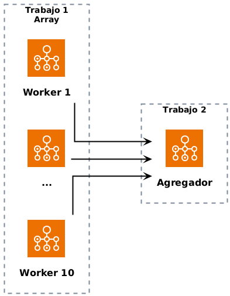
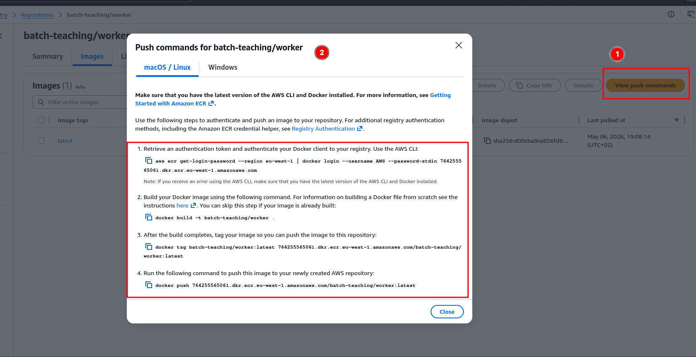
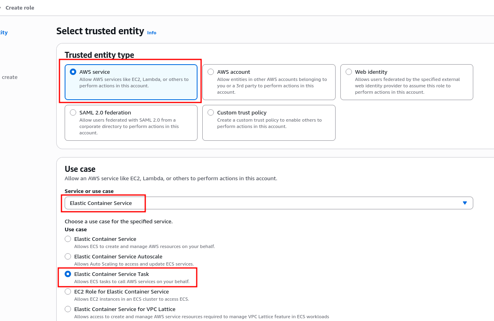

* Procesamiento de trabajos por lotes - AWS Batch
#+begin_quote
[!IMPORTANT]
Utilizaremos la *Landing Zone* en la región ~us-east-1~ para realizar esta práctica.
#+end_quote

Los objetivos de esta práctica son los siguientes:
- Comprender los fundamentos de los trabajos de procesamiento por lotes
- Ejecutar trabajos de procesamiento por lotes basados en contenedores
- Utilizar servicios gestionados para la ejecución de trabajos de procesamiento por lotes
- Utilizar el servicio AWS Batch

** Referencias
- [[https://docs.aws.amazon.com/batch/latest/userguide/what-is-batch.html][Documentación de AWS Batch]]

* Arquitectura
#+begin_src plantuml :file ./imagenes/00-arquitectura_1.png :exports results
  @startuml VPC
  !define AWSPuml https://raw.githubusercontent.com/awslabs/aws-icons-for-plantuml/v19.0/dist
  !include AWSPuml/AWSCommon.puml
  !include AWSPuml/AWSSimplified.puml
  !include AWSPuml/Compute/Batch.puml
  !include AWSPuml/Groups/Generic.puml

  left to right direction
  skinparam linetype ortho

  GenericGroup(job1, "Trabajo 1\nArray") {
    Batch(worker1, "Worker 1", "")
    Batch(worker2, "...", "")
    Batch(worker10, "Worker 10", "")
  }
  
  GenericGroup(job2, "Trabajo 2") {
    Batch(aggregator, "Agregador", "")
  }

  worker1 ---> aggregator
  worker2 ---> aggregator
  worker10 ---> aggregator
  @enduml
#+end_src

#+RESULTS:

* Funcionamiento
Dado un fichero con una lista de números, el procesamiento consiste en *dos fases* que se ejecutan en serie, una a continuación de otra:
1. Trabajo de tipo *array* - Ejecuta diez tareas en paralelo. Cada tarea se encarga de comprobar si un número es primo.
2. Trabajo de tipo *agregador* - *Espera a que todas las tareas del trabajo 1 se completen*. A continuación, recoge los resultados de dichas tareas y compone un *resumen*.

#+begin_src
input/numbers.json
      │
      ▼
┌─────────────────────────────────────────┐
│  Trabajo Array: worker (10 tareas)      │
│  task 0 → output/0.json                 │
│  task 1 → output/1.json                 │
│  ...                                    │
│  task 9 → output/9.json                 │
└─────────────────────────────────────────┘
      │
      ▼
┌─────────────────────────────────────────┐
│  Trabajo: agregador                     │
│  lee ficheros output/*.json             │
│  produce output/summary.json            │
└─────────────────────────────────────────┘
#+end_src

Se utiliza el servicio *S3* para trabajar con los ficheros de entrada y salida.

* Desarrollo de la práctica
** Bucket S3
Crea un bucket en S3 para almacenar los archivos y los resultados de los trabajos de procesamiento. Anota el nombre del bucket.

** Repositorio ECR
Crea *dos* repositorios privados en *ECR* para alojar las imágenes de las dos aplicaciones que utilizaremos en la práctica:
1. ~/practica-batch-TUS_INICIALES/worker~
2. ~/practica-batch-TUS_INICIALES/aggregator~

** Creación y subida de las imágenes de contenedor
Utiliza las instrucciones proporcionadas en los repositorios ECR para construir y subir las imágenes de las dos aplicaciones de contenedores proporcionadas en las carpetas de este repositorio:
1. ~worker/~
2. ~aggregator/~

#+begin_quote
[!IMPORTANT]
Puedes utilizar *CloudShell* para descargar el repositorio y construir y publicar las imágenes de contenedores.

También puedes utilizar tu equipo personal o un entorno de Visual Studio Code Server desplegado en EC2 como los utilizados en prácticas anteriores.
#+end_quote

** Roles para los trabajos Batch
Crea *dos roles* en IAM:
1. Un rol denominado ~BatchExecutionRole~, asociado a la política gestionada ~AmazonECSTaskExecutionRolePolicy~. Se utilizará como *rol de ejecución* en la definición del trabajo Batch. Este rol se utilizará para descargar las imágenes de contenedor y lanzar los trabajos.
2. Un rol denominado ~BatchJobRole~, asociado a la política gestionada ~AmazonS3FullAccess~. Se utilizará como *rol de tarea* en la definición del trabajo Batch. Este rol será utilizado por el código que se ejecuta en los contenedores para poder acceder a S3 y leer y escribir archivos.

Ambos roles tendrán el servicio ~ecs-tasks.amazonaws.com~ como entidad de confianza:

** Entorno de computación
Crea un *entorno de computación* en el servicio AWS Batch con los siguientes ajustes:
- ~Fargate~
- Maximum vCPUs = 16
- Elige un conjunto de *subredes públicas* en una VPC de tu elección
- Elige un *grupo de seguridad* que permita *todo tráfico entrante desde cualquier IP* (créalo si no existe)

** Cola de trabajos
Crea una *cola de trabajos* en el servicio AWS Batch con los siguientes ajustes:
- ~Fargate~
- Prioridad = 1
- Entorno de computación creado en el apartado anterior

** Definiciones de trabajo
Crea dos *definiciones de trabajo* en el servicio AWS Batch con los siguientes ajustes:
1. Definición de trabajo ~worker~:
   - ~Fargate~
   - Rol de ejecución = ~BatchExecutionRole~, creado en un apartado anterior
   - Intentos máximos = 3
   - Imagen de contenedor = URL del contenedor ~worker~ en ECR
   - Rol del trabajo = ~BatchJobRole~
   - vCPUs = 1
   - Memory = 2 GB
   - Variables de entorno:
     - ~BUCKET~ = nombre del bucket creado en pasos anteriores
     - ~INPUT_KEY~ = ~input/numbers.json~
     - ~OUTPUT_KEY~ = ~output/~
2. Definición de trabajo ~aggregator~:
   - ~Fargate~
   - Rol de ejecución = ~BatchExecutionRole~, creado en un apartado anterior
   - Intentos máximos = 3
   - Imagen de contenedor = URL del contenedor ~aggregator~ en ECR
   - Rol del trabajo = ~BatchJobRole~
   - vCPUs = 1
   - Memory = 2 GB
   - Variables de entorno:
     - ~BUCKET~ = nombre del bucket creado en pasos anteriores
     - ~OUTPUT_KEY~ = ~output/~
     - ~ARRAY_SIZE~ = 10
 
** Archivos de trabajo
Sube al bucket S3 el archivo ~numbers.json~ de la carpeta del repositorio. Guárdalo en la ruta ~input/numbers.json~.

** Lanzamiento de trabajos
Crea *dos trabajos* en el servicio AWS Batch con los siguientes ajustes:
1. Nombre ~worker-TUS_INICIALES~
   - Cola de trabajos = la cola creada en el apartado anterior
   - Definición de trabajo = ~worker~
   - Tamaño de array = 10
2. Nombre ~aggregator-TUS_INICIALES~
   - Cola de trabajos = la cola creada en el apartado anterior
   - Definición de trabajo = ~aggregator~
   - Dependencia = id del trabajo ~worker_TUS_INICIALES~ creado antes

** Comprobación del resultado
Haz *capturas de pantalla* de la *ejecución de los trabajos* completados. Comprueba también que se genera el resultado en la carpeta ~output~ del bucket S3 creado.

* Entrega
Documenta la realización de la práctica explicando los pasos seguidos. Incluye las *capturas de pantalla* necesarias. Recuerda mostrar tus datos personales (nombre y apellidos, iniciales) en aquellos apartados donde se indique.

* Limpieza
No es necesario eliminar ningún recurso en esta práctica. Si lo deseas, puedes eliminar todos los recursos creados en el servicio *AWS Batch* y los *repositorios de ECR*.
